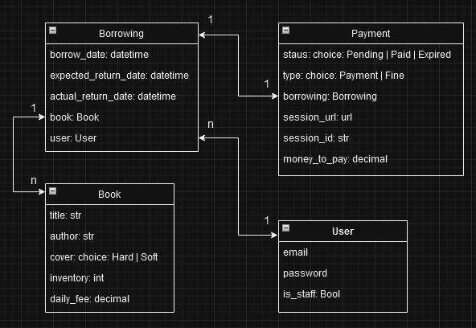

# Library-Service-Project

Library Service Project designed to provide a management system for book borrowings. 
This API can be used to: create profiles, books add borrowing/return books, 
getting automatic notification on telegram about borrowings.

## Table of Contents

- [Features](#features)
- [Installation](#installation)
- [Run with Docker](#Run-with-Docker)
- [Database structure](#Database-structure)

## Features:

- User registration and login with email
- Manage books and books borrowing
- JWT authentication support
- Filter active borrowings and borrowings by users
- API documentation

## Installation

1. Clone the repository:
   ```
   git clone https://github.com/V-Shkrobatskyi/Library-Service-Project.git
   cd Library-Service-Project
   python -m venv venv
   venv\Scripts\activate (on Windows)
   source venv/bin/activate (on macOS)
   pip install -r requirements.txt
   ```
2. Copy .env_sample -> env. and populate with required data:
   ```
   POSTGRES_HOST="db host"
   POSTGRES_PORT="db port"
   POSTGRES_NAME="db name"
   POSTGRES_USER="db user"
   POSTGRES_PASSWORD="user password"
   
   SECRET_key="django secret key"
   
   TELEGRAM_BOT_TOKEN="Telegram bot token"
   TELEGRAM_CHAT_ID="Telegram chat id"

   CELERY_BROKER_URL=redis://redis:6379
   CELERY_RESULT_BACKEND=redis://redis:6379
   ```
[How to get Telegram bot token](https://core.telegram.org/bots/features#botfather)

How to get "Telegram chat id":
- go to web telegram version
- start new group and add your bot there
- in group url "Telegram chat id" is after symbol #

3. Run database migrations and start server:
    ```
    python manage.py makemigrations
    python manage.py migrate
    python manage.py runserver
    ```

## Run with Docker

Docker should be installed.

1. Pull docker container:
   ```
   docker pull 
   ```
2. Run docker container
   ```
    docker-compose build
    docker-compose up
   ```

## Database structure


